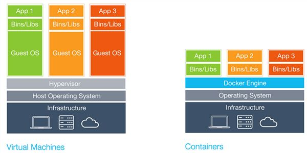
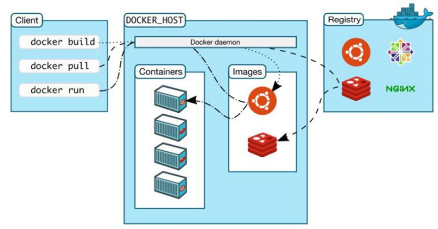

# 认识Docker

## 一、什么是Docker

官方定义：An open source project to pack, ship and run any application as a lightweight container.

Node.js定义：allows to package an applicaion with all of its dependencies into a standardized unit.

简单来说，Docker就是一个可以运行应用的容器。也可以粗糙得被理解为轻量级的虚拟机。本质上他们都是把一个应用程序放在了独立的环境里来运行。

## 二、VW vs Docker

在宿主系统上，VM通过Hyervisor又创建了各个不同的客户系统，然后应用程序和库文件都在相应的客户系统上运行。Docker则省去了很多中间环节，只要在宿主系统上安装了Docker，我们就可以把应用和库文件借助Docker引擎运行起来了。

## 三、Docker的架构

Docker是C/S结构，守护进程（即Docker deamon）运行在宿主机器上，用户借助安装在客户机上的客户端程序（Client）通过命令行的形式与守护进程交互。守护进程接收到命令后执行并返回运行结果。

## 四、镜像和容器以及他们的关系
### 1.镜像
官方定义：An image is an executable package that includes everything needed to run an application--the code, a runtime, libraries, environment variables, and configuration files.

镜像是包含了运行一个应用程序所需要的一切的可执行文件包，包括应用程序的代码，运行环境，库，环境变量和配置文件。

### 2.容器
官方定义：A container is a runtime instance of an image--what the image becomes in memory when executed (that is, an image with state, or a user process).

容器是一个镜像运行后的实例，即一个镜像被加载到内存以后的形态，也可以说是有了状态的镜像或一个用户进程。

### 3.镜像与容器的关系
镜像和容器的关系，就像是面向对象程序设计中的类和实例一样，镜像是静态的定义，容器是镜像运行时的实体。容器可以被创建、启动、停止、删除、暂停等。
