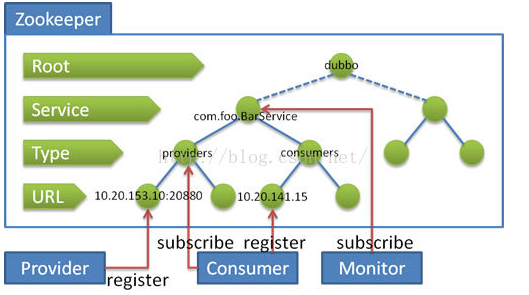

# ZooKeeper注册中心

## 流程说明
  1. 服务提供者（Provider）启动时，向/dubbo/com.foo.BarService/providers目录下写入自己的URL地址。
  2. 服务消费者（Consumer）启动时，订阅/dubbo/com.foo.BarService/providers目录下的提供者URL地址。同时向/dubbo/com.foo.BarService/consumers目录下写入自己的URL地址。
  3. 监控中心启动时，订阅/dubbo/com.foo.BarService目录下写入自己的URL地址。

## 功能支持
  1. 当提供者出现断电等异常停机时，注册中心能自动删除提供者（Provider）信息。
  2. 当注册中心重启时，能自动回复注册数据，以及订阅请求。
  3. 当回话过期时，能自动回复租车数据，以及订阅请求。
  4. 当设置<dubbo:registry check="false" />时，记录失败注册和订阅请求，后台定时重试。
  5. 可通过<dubbo:registry username="admin" password="1234" />设置zookeeper登录信息。
  6. 可通过<dubbo:registry group="dubbo" />设置zookeeper的根节点，不设置将使用无根树。
  7. 支持*号通配符<dubbo:reference group="*" version="*" />，可订阅服务的所有分组和所有版本的提供者。
