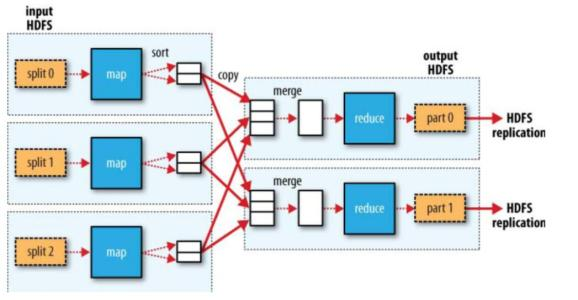

# MapReduce基础与编程模型

## MapReduce基础
### 一、MapReduce是什么
MapReduce是Google的一项重要开源技术，它是一个编程模型，用于大数据量的计算。对于大数据量的计算，通常采用的处理方式就是并行计算。但对于许多开发人员来说，自己完完全全实现一个并行计算程序难度太大，而MapReduce就是一种简化并行计算的变成模型，它使得没有多少并行计算经验的开发人员也可以开发并行应用程序。这也是MapReduce的价值所在，通过简化编程模型，降低了开发并行应用程序的入门门槛。
### 二、MapReduce设计目标
MapReduce的设计目标是方便编程人员在不熟悉分布式并行编程的情况下，将自己的程序运行在分布式系统上。MapReduce采用的是“分而治之”的思想，即把对大规模数据集的操作，分发给一个主节点管理下的各个子节点共同完成，然后整个各个子节点的中间结果，从而得到最终的计算结果。简而言之，MapReduce就是“分散任务，汇总结果”。
### MapReduce特点
  1. 易于编程。MapReduce只需简单地实现一些接口，就可以完成一个分布式程序，这个分布式程序可以分布到大量廉价的PC机上运行。也就是说你写一个分布式程序，跟写一个简单的串行程序是一模一样的。
  2. 良好的拓展性。当你的计算资源不能得到满足的时候，可以通过简单的增加机器拓展它的计算能力。
  3. 高容错性。
  4. 能对PB量级以上海量数据进行离线处理。适合离线处理而不适合实时处理，比如要求毫秒级返回一个结果，MapReduce将很难做到。

### MapReduce不擅长的场景
  1. 实时计算：MapReduce无法像MySql一样，在毫秒或者秒级内返回结果。
  2. 流式计算：流式计算的输入数据是动态的，而MapReduce的输入数据集是静态的，不能动态变化。
  3. DAG（有向图）计算：多个应用程序存在依赖关系，后一个应用程序的输入为前一个应用程序的输出。在这种情况下，MapReduce并不是不能做，而是使用其之后，每个MapReduce作业的输出结果都会写入到磁盘，会造成大量的磁盘IO，降低使用性能。

## MapReduce编程模型
MapReduce由两个阶段组成：Map和Reduce。用户只需编写map()和reduce()两个函数，即可完成简单的分布式程序的设计。

MapReduce将作业（一个MapReduce应用程序）的整个运行过程分为Map阶段和Reduce阶段，编程模型如图。
  1. Map阶段由一定数量的Map Task组成。
    * 数据数据格式解析：InputFormat(把输入文件分片)
    * 输入数据处理：Mapper
    * 数据分组：Partitioner
  2. Reduce阶段由一定数量的Reduce Task组成。
    * 数据远程拷贝（从Map Task的输出拷贝部分数据）
    * 数据按照key排序和分组（key相同的都放在一起，按照key进行分组操作，每一组交由Reducer进行处理）
    * 数据处理：Reducer
    * 数据输出格式：OutputFormat(输出文件格式、分隔符等的设置)

map()函数以key/value对作为输入，产生另外一系列key/value对作为中间输出写入本地磁盘。MapReduce框架会自动将这些中间数据按照key值进行聚集，且key值相同（用户可设定聚集策略，默认情况下是对key值进行哈希取模）的数据被统一交给reduce()函数处理。reduce()函数以key以及对应的value列表作为输入，经合并key相同的value值后，产生另外一系列key/value对作为最终输出写入HDFS。
