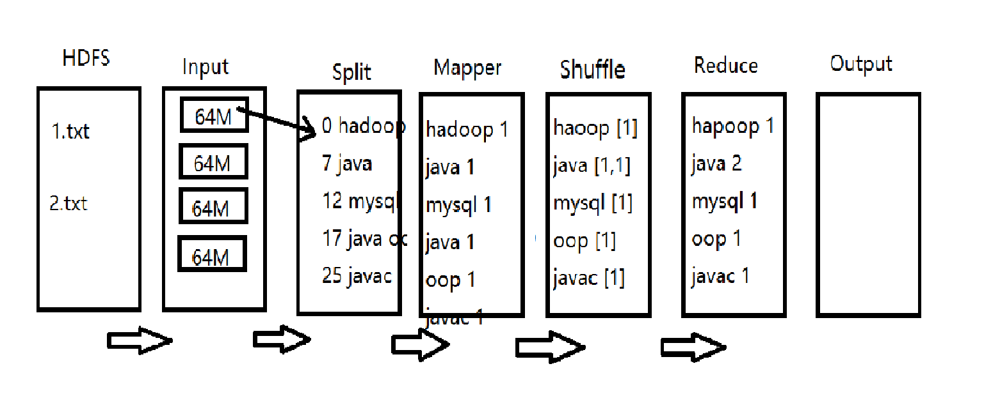

# WordCount开发

## 一、流程整理

词频统计的分布式计算流程：
1. HSDF获取文件：需要计算的源文本存在于HDFS系统上。
2. Input（文件输入）：HDFS中的文件都是以块（Block）为单位存储。源文本文件被划分为多个块，分发到不同的节点并行计算。
3. Split(切片)：按行切片，将Input中的块按照行切成片（键值对）。键为行起始字符的下标位置，值为每行的字符串。
4. Map：具体功能由设计者定义。在词频统计中，将切片（行）进一步拆分成由空格分隔出的单词和数值1组成的键值对表。
5. Shuffle(混洗)：将所有Block中的所有键值对表中相同键的数据合并成一条，值是由相同键次数个1组成的数组。
6. Reduce：具体功能由设计者定义。在词频统计中，将键对应数组中的所有1加和，即得出每个单词出现的次数。
7. Output:将计算结果写入文件，并存储到指定路径下。

## 二、开发
### 准备
1. 新建mapreduce项目：wordcountdemo
2. 为项目添加core-site.xml和log4j.property文件
3. 添加jar包（mapreduce项目自带工具包）

### Mapper开发

### Reducer开发

### 创建并启动Job

## 三、总结
1. Mapper开发要求：
 * 开发的Mapper类须是静态类
 * 开发的Mapper类须继承hadoop
