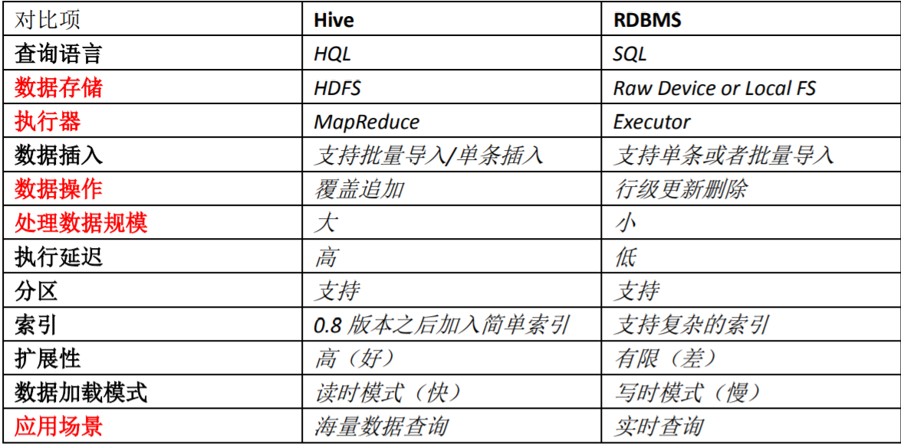
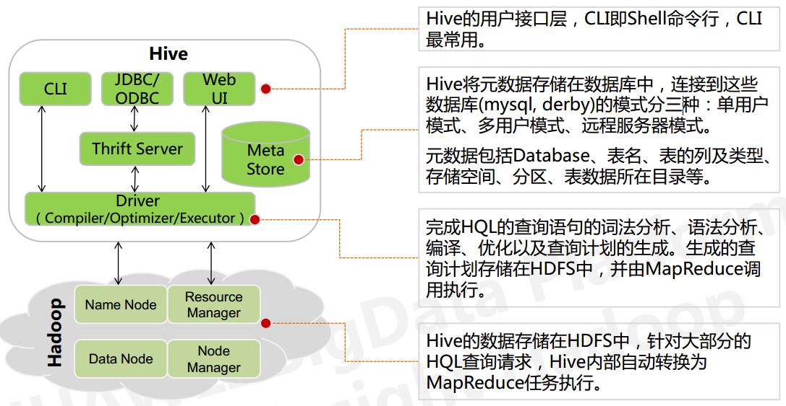

* [Hive简介](#Hive简介)
    * [一、什么是Hive](#一、什么是Hive)
    * [二、为什么使用Hive](#二、为什么使用Hive)
    * [三、Hive的特点](#三、Hive的特点)
    * [四、Hive的架构](#四、Hive的架构)
    * [五、Hive执行流程](#五、Hive执行流程)

# Hive简介
## 一、什么是Hive
Hive是由Facebook实现并开源，是基于Hadoop的一个数据仓库工具，可以将结构化的数据映射为一张数据库表，并提供HQL(Hive SQL)查询功能。底层数据是存储在HDFS上，本质是将SQL语句转换为MapReduce任务运行，使不熟悉MapReduce的用户很方便地利用HQL处理和计算HDFS上的结构化数据，适用于离线的批量数据计算。
## 二、为什么使用Hive

直接使用MapReduce所面临的问题：
  1. 人员学习成本太高
  2. 项目周期要求太短
  3. MapReduce实现复杂查询逻辑开发难度太大

为什么要使用Hive:
  1. 更友好的接口：操作接口采用类SQL的语法，提高快速开发的能力
  2. 更低的学习成本：避免了写MapReduce,减少开发人员的学习成本
  3. 更好的拓展新：可自由拓展集群而无需重启服务，还支持用户自定义函数

## 三、Hive的特点

优点：
  1. 可拓展性，横向扩展。Hive可以自由的扩展集群的规模，一般情况下不需要重启服务
  2. 延展性。Hive支持自定义函数，用户可以根据自己的需求来实现自己的函数
  3. 良好的容错性。可以保障即使节点出现问题，SQL语句仍可完成执行。

缺点：
  1. Hive不支持记录级别的增删改操作
  2. Hive的查询延时很严重
  3. Hive简介不支持事务

Hive和RDBMS对比：

总结：
Hive具有SQL数据库的外表，但应用场景完全不同。`Hive只适合用来做海量离线数据统计分析，也就是数据仓库`。

## 四、Hive的架构

从上图可以看出，Hive的内部架构由四部分组成：
  1. 用户接口：shell/CLI,JDBC/ODBC,webUI Command Line Interface
    * CLI，Shell,采用交互形式使用Hive命令行与Hive进行交互，最常用于学习、调试、生产
    * JDBC/ODBC，Hive的基于JDBC操作的客户端，开发、运维人员通过代码连接至Hive server
    * Web Ui,通过浏览器访问UI
  2. 跨语言服务：Thrift Server 让用户可以使用多种不同的语言来操纵Hive

      Thrift是Facebook开发的一个软件框架，可以用来进行可拓展且跨语言的服务的开发，Hive集成了该服务，能让不同的变成语言调用Hive的接口
  3. 底层的Driver:驱动器Driver，编译器Complier，优化器Optimizer，执行器Executor

      Driver组件完成HQL查询语句从词法分析、语法分析、编译，优化，以及生成逻辑执行计划。生成的逻辑执行计划存储在HDFS中，并随后由MapReduce调用执行。
      Hive的核心是驱动引擎，驱动引擎由四部分组成：
      * 解释器：将HiveSQL语句转换为抽象语法数（AST）
      * 编译器：将语法树编译为逻辑执行计划
      * 优化器：对逻辑执行计划进行优化
      * 执行器：调用底层的运行框架执行逻辑执行计划
      
  4. 元数据存储系统：RDBMS MySQL

     * 元数据，通俗的讲，就是存储在Hive中的数据的描述信息
     * Hive中的元数据通常包括：表的名字、表的列表和分区及其属性，表的属性（内部表和外部表），表的数据所在目录
     * Metastore默认存在自带的Derby数据库中。缺点就是不适合多用户操作，并且数据存储目录不固定。数据库跟着Hive走，极度不方便管理。解决方案：通常存         在我们自己创建的MySQL库（本地或远程）
     * Hive和MySQL之间通过MetaStore服务交互
    
## 五、Hive执行流程
HiveSQL通过命令行或者客户端提交，经过Compiler编译器，运用MetaStore中的元数据进行类型检测和语法分析，生成一个逻辑方案，然后通过的优化处理产生一个MapReduce任务执行。
