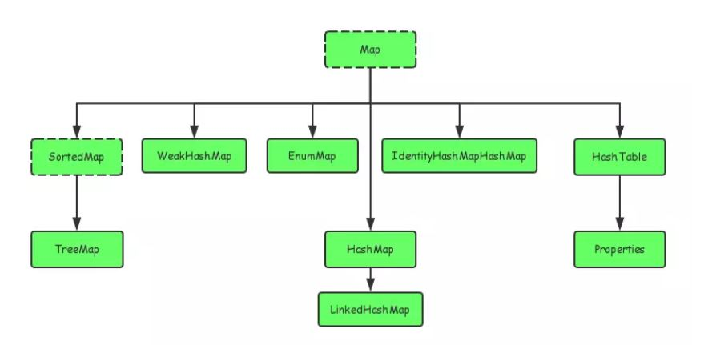

# Java基础之集合
1. Java的集合类型主要有哪些？它们之间的继承关系是什么样的？

2. Arraylist实现机制？

3. Hashmap是如何工作的？

4. Hashmap和HashTable有何不同？

5. 那些集合类是线程安全的？
Vector、HashTable、Properties和Stack是同步类，所以它们是线程安全的，可以在多线程环境下使用。

6. 并发集合类是什么？
Java1.5并发包（java.util.concurrent）包含线程安全集合类，允许在迭代时修改集合。迭代器被设计为fail-fast的，会抛出ConcurrentModificationException。一部分类为：CopyOnWriteArrayList、 ConcurrentHashMap、CopyOnWriteArraySet。

7. hashCode()和equals()方法有何重要性？

8. Iterator是什么？
