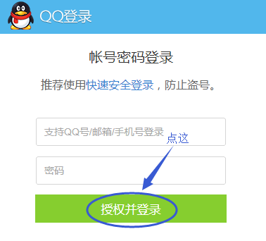

# OAuth2.0
 * OAuth2.0是什么？
 * 为什么OAuth？
 * OAuth2.0怎么用？

## 一、场景
用户想登陆豆瓣去看看电影评论，但从来没注册过豆瓣账号，又不想新注册一个再使用豆瓣，可不可以通过用户已有的QQ或微信账号登陆呢？

1. 用户在豆瓣官网点击用qq登陆：

2. 跳转到qq登陆页面，输入用户名密码，然后点授权登陆：

3. 跳回到豆瓣页面，成功登陆：

## 二、OAuth2.0是什么

简单来说，上述例子中的豆瓣就是客户端（Client或Third-paryt application），QQ就是认证服务器（Authoriztion server）,OAuth2.0就是客户端和认证服务器之间由于相互不信任而产生的一个授权协议。

## 三、原理及实现过程
下图描绘了只几秒钟发生的所有事情用上帝视角来看的流程：

1. 当用户点击用qq登陆的小图标时，实际上是想豆瓣服务器发起了一个：http://www.douban.com/leadToAuthorize 的请求，豆瓣服务器会响应一个重定向地址，指向qq授权登陆。
2. 浏览器连接到重定向地址：http://www.qq.com/authorize?callback=www.douban.com/callback，再次访问。注意，这次访问带了一个参数是callback，以便qq那边授权成功再次让浏览器发起这个callback请求。不然qq怎么知道你让我授权后要返回哪个页面啊。
3. qq的服务器接收到了豆瓣访问的authorize，给出的回应是跳转到qq的登陆页面，用户输入账号密码并授权登陆后，一定会访问qq服务器中校验用户名密码的方法。若验证成功，该方法会响应浏览器之前给出的重定向地址，并附上一个code(授权码)：http://www.douban.com/callback?code=xxx。
4. 豆瓣服务器收到请求后，做了两件再与QQ沟通的事，即模拟浏览器发起了两次请求，一个是用拿到的code去换token，另一个就是用拿到的token换取用户信息。
5. 最后服务器将用户信息存储起来，返回给浏览器首页的视图，到此OAuth2.0授权结束。
