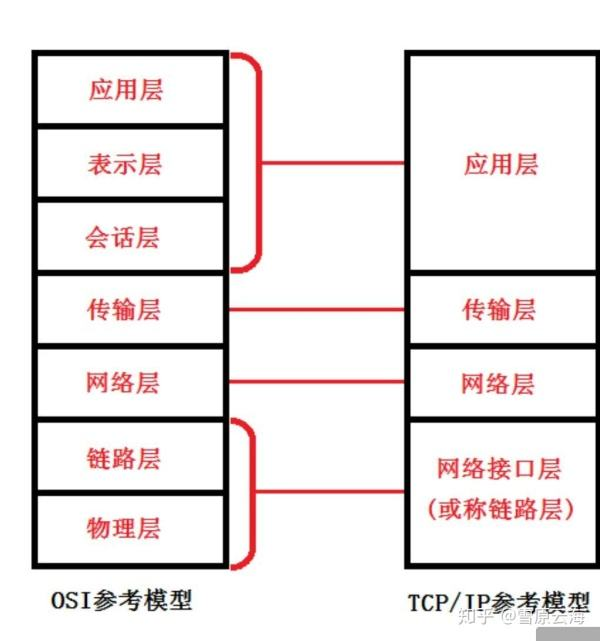
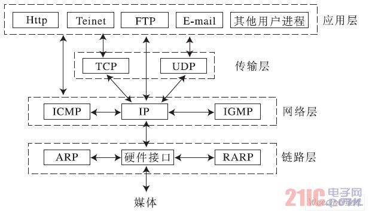

# 七层网络模型与四层网路模型

## 为什么有网络分层模型?
网络协议设计者不应当设计一个单一、巨大的协议来为所有形式的通信规定完整的细节，而应把通信问题划分成多个小问题，然后为每个小问题设计一个单独的协议。这样做使得每个协议的设计、分析、时限和测试都比较容易。协议划分的一个主要原则是确保目标系统有效且效率高。为了提高效率，每个协议只应该注意没有被其他协议处理过的那部分通信问题；为了主协议的实现更加有效，协议之间应该能够共享特定的数据结构；同时这些协议的组合应该能够处理所有可能的硬件错误以及其他异常情况。为了保证这些协议工作的协同性，应当将协议设计和开发成完整的、协作的协议系列（即协议族），而不是孤立地开发每个协议。

## ISO七层网络协议模型
网络历史的早期，国际标准化组织（ISO）和国际哦电报电话咨询委员会（CCITT）共同出版了开放系统互联的七层参考模型。

1. 物理层。负责最后将信息编码成电流脉冲或其它信号用于网上传输。它由计算机和网络介质之间的实际界面组成，可定义电气信号、符号、线的状态和时钟要求、数据编码和数据传输用的连接器。如最常用的RS-232规范、10BASE-T的曼彻斯特编码以及RJ-45就属于第一层。
2. 数据链路层。通过物理网络链路提供可靠的数据传输。不同的数据链路层定义了不同的网络和协议特征，其中包括物理编址、网络拓扑结构、错误校验、帧序列以及流控。
3. 网络层。负责在源和终点之间建立连接。它一般包括网络寻径，还可能包括流量控制、错误检查等。相同MAC标准的不同网段之间的数据传输一般只涉及到数据链路层，而不同的MAC标准之间的数据传输都涉及到网络层。例如IP路由器工作在网络层，因而可以实现多种网络间的互联。
4. 传输层。传输层向高层提供可靠的端到端的网络数据流服务。传输层的功能一般包括流控、多路传输、虚电路管理及差错校验和恢复。
5. 会话层。会话层建立、管理和终止表示层与实体之间的通信会话。通信会话包括发生在不同网络应用层之间的服务请求和服务应答，这些请求与应答通过会话层的协议实现。它还包括创建检查点，使通信发生中断的时候可以返回到以前的一个状态。
6. 表示层。表示层提供多种功能用于应用层数据编码和转化，以确保以一个系统应用层发送的信息可以被另一个系统应用层识别。
7. 应用层。应用层是最接近终端用户的OSI层，这就意味着OSI应用层与用户之间是通过应用软件直接相互作用的。注意，应用层并非由计算机上运行的实际应用软件组成，而是由向应用程序提供访问网络资源的API（Application Program Interface，应用程序接口）组成，这类应用软件程序超出了OSI模型的范畴。应用层的功能一般包括标识通信伙伴、定义资源的可用性和同步通信。

## 七层协议是如何协作完成网络传输的？

发送是这样的：从网络进程产生的发送数据，首先进入应用层，被附件头信息以后，用于完成应用层的功能，然后进入表示层，在被附加头信息，同样是用于完成表示层的功能，如此一直往下进行，在物理链路层形成最后要输出的帧（附加了所有的头信息后），帧数据再经过物理层以后根据物理介质被转化成实际的物理信号，比如电信号或者光信号，发送到网线或无线上。
接受恰好是相反的过程：从网络过来的数据，从下到上，验证各个头信息以后剥离，最终还原回发送端的原始数据，完成了网络传输。

## 基于TCP/IP的四层网络模型
TCP/IP分层模型（TCP/IP Layening Model）被称作因特网分层模型、因特网参考模型。它与ISO模型的对比如下：

1. 网络接口层。包括用于协作IP数据在已有网络介质上传输的协议。实际上TCP/IP标准并不定义与ISO数据链路层和物理层相对应的功能。相反，它定义像地址解析协议(Address Resolution Protocol,ARP)这样的协议，提供TCP/IP协议的数据结构和实际物理硬件之间的接口。
2. 包含IP协议、RIP协议(Routing Information Protocol，路由信息协议)，负责数据的包装、寻址和路由。同时还包含网间控制报文协议(Internet Control Message Protocol,ICMP)用来提供网络诊断信息。
3. 传输层。对应于OSI七层参考模型的传输层，它提供两种端到端的通信服务。其中TCP协议(Transmission Control Protocol)提供可靠的数据流运输服务，UDP协议(Use Datagram Protocol)提供不可靠的用户数据报服务。
4. 应用层。对应于OSI七层参考模型的应用层和表达层。因特网的应用层协议包括Finger、Whois、FTP(文件传输协议)、Gopher、HTTP(超文本传输协议)、Telent(远程终端协议)、SMTP(简单邮件传送协议)、IRC(因特网中继会话)、NNTP（网络新闻传输协议）等。

