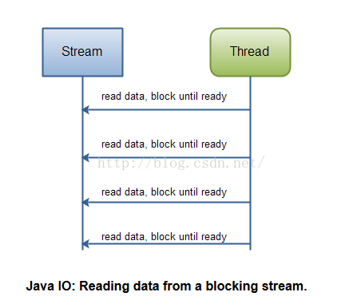
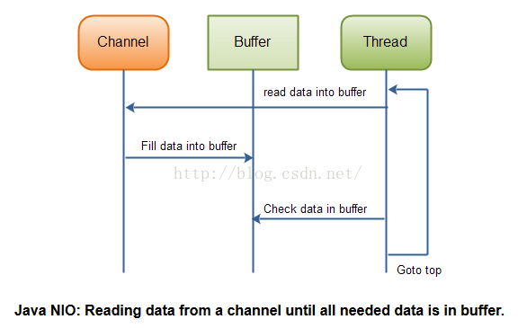
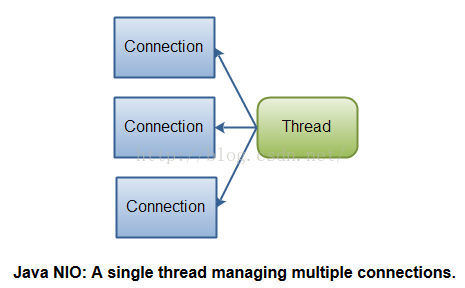
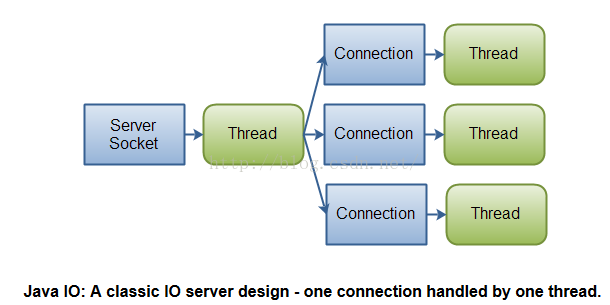

# IO与NIO的区别

## 一、NIO vs IO
区别如下：

| IO | NIO   |
| :------------- | :------------- |
| 面向Stream      | 面向Buffer       |
| 阻塞IO       | 非阻塞IO      |
|        | Selector       |

## 二、面向Stream和面向Buffer
### 2.1 面向Stream

* 面向流意味着从流中一次可以读取一个或多个字节，这里没有任何缓存（这里指的是使用流没有任何缓存，接受或者发送的数据是缓存到操作系统中的，就像一个水管从操作系统的缓存中读取数据）
* 另外，面向流只能顺序从流中读取数据，如果需要跳过一些字节或者再读取已经读过的字节，你必须将从流中读取的数据先缓存起来。

### 2.2 面向Buffer
面向缓存的处理方式有些不同。数据是先被读/写到buffer中的，根据需要你可以选择读取数据的位置。这在处理的过程中给用户多了一些灵活性。但同时也带来了额外的工作，你需要自己检查数据是否已经全部到了buffer中，你还需要保证当有更多的数据进入buffer中时，buffer中未处理的数据不会被覆盖。

## 三、阻塞IO和非阻塞NIO
### 3.1 阻塞IO
所有的Java IO流都是阻塞的，这意味着，当一条线程执行read()或者write()方法时，这条线程会一直阻塞直到读取到了一些数据或者要写出去的数据已经全部写出，这在期间这条线程不能做任何其他的事情。
### 3.2 非阻塞NIO
Java NIO有阻塞模式和非阻塞模式。阻塞模式的NIO除了使用Buffer存储数据外和IO基本没有区别。非阻塞模式允许一条线程从多个channel中读取数据，通过判断返回值来判断buffer中是否有数据。如果没有数据，NIO不会阻塞，因为不阻塞这条线程就可以去做其他的事情，过一段时间再回来判断一下有没有数据。NIO的写也是一样的，一条线程将buffer中的数据写入channel，它不会等待数据全部写完才返回，而是调用完write()方法就会继续向下执行。

## 四、NIO和IO对应用的设计有何影响
1. 使用IO和NIO的API是不同的（废话）
2. 处理数据的方式
3. 处理数据所用到的线程数

### 处理数据的方式的不同
在IO的设计里，要一个字节一个字节从InputStream或者Reader中读取数据，想象你正在处理一个向下面的基于行分割的流：
```
1. Name:Anna
2. Age: 25
3. Email: anna@mailserver.com
4. Phone:1234567890
```
处理文本行的流的代码应该类似下面这样：
```
InputStream input=... ; //get the InputStream from the client socket
BufferedReader reader= new BufferedReader(new InputStreamReader(input));
String nameLine=reader.readLine();
String ageLine=reader.readLine();
String emailLine=reader.readLine();
String phoneLine=reader.readLine();
```
注意，一旦reader.readLine()方法返回，你就可以确定整行已经被读取，readLine()阻塞直到一整行都被读取：



NIO的实现会有些不同，下面是一个简单的例子：
```
ByteBuffer buffer=ByteBuffer.allocate(48);
int bytesRead=inChannel.read(buffer);
```
注意第二行从channel中读取数据到ByteBuffer,当这个方法返回时，你不知道所需要的数据是否都被读到buffer了，你所知道的一切就是有一些数据被读到buffer了，但是你并不知道具体有多少数据，这使程序的处理变得稍微有些困难。

想象一下，调用了read(buffer)后，只有半行数据被读进了buffer，例如：“Name:An”，你能现在就处理数据吗？当然不能。你需要等待直到至少一整行数据被读入到buffer中，在这之前确保程序不要处理buffer中的数据。

你如何知道buffer中是否有足够的数据可以被处理呢？你不知道，唯一的方法就是检查buffer中的数据。可能你会进行几次无效的检查（检查了几次数据都不够进行处理），这会令程序设计变得比较混乱复杂。
```
ByteBuffer buffer=ByteBuffer.allocate(48);
int bytesRead=inChannel.read(buffer);
while(! bufferFull(bytesRead)){
  bytesRead = inChannel.read(buffer);
}
```
bufferFull方法负责检查有多少数据被读到了buffer中，根据返回值true还是false来判断数据是否能够进行处理。bufferFull方法扫描buffer但不能改变buffer的内部状态。is-data-in-buffer-ready循环柱状图如下：



## 总结
NIO允许你用一个单独的线程或几个线程管理很多个channels(网络的或者文件的)，代价是程序的处理和处理IO相比更加复杂。如果你需要同时管理成千上万的连接，但是每个连接至发送少量的数据，例如一个聊天服务器，用NIO实现会更好一些；相似的，如果你需要保持跟多个其它电脑的连接，例如P2P网络，用一个单独的线程来管理所有出口连接时比较合适的。



如果你只有少量的连接，但是每个连接都占有很高的带宽，同时发送很多数据，传统的IO会更合适。



原文链接：https://www.cnblogs.com/xuxinstyle/p/9546052.html
