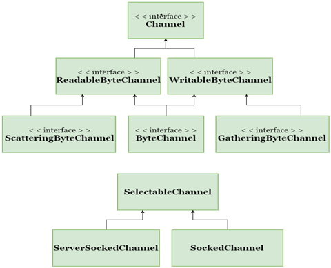

# NIO通道和缓冲

## 一、概述
基本上所有的IO在NIO中都从一个Channel开始。Channel有点像流。数据可以从Channel读到Buffer，也可以从Buffer写到Channel中，如下图所示：


### 1.1 Channel通道

Channel和Buffer有好几种类型。下面是JAVA NIO中的一些主要Channel的实现：
* FileChannel
* DatagramChannel
* SocketChannel
* ServerSocketChannel




这些通道涵盖了UDP和TCP网络IO，以及文件IO。

### 1.2 Buffer缓冲
* ByteBuffer
* CharBuffer
* DoubleBuffer
* FloatBuffer
* IntBuffer
* LongBuffer
* ShortBuffer
这些Buffer覆盖了你能通过IO发送的基本数据类型：byte, short, int, long, float, double 和 char。

## 二、通道详解与实例
### 2.1 通道基础
Java NIO的通道类似流，但又有些不同：
* 既可以从通道中读取数据，有可以写数据到通道。但流的读写通常是单向的。
* 通道可以异步地读写。
* 通道中的数据总是要先读到一个Buffer，或者总是要从一个Buffer中写入。
### 2.2 主要通道详解
* FileChannel：文件通道用于从文件读取数据。它只能通过调用getChannel()方法来创建对象。不能直接创建FileChannel对象。
```
FileInputStream fis = new FileInputStream("D:\\file-read.txt"); // Path of Input text file  
ReadableByteChannel rbc = fis.getChannel();
```
* DatagramChannel:数据报通道可以通过UDP（用户数据报协议）通过网路读取和写入数据。它使用工厂方法来创建对象。
* SocketChannel：套接字通道可以通过TCP（传输控制协议）通过网络读取和写入数据。它还使用工厂方法来创建新对象。
* ServerSocketChannel：允许用户监听传入的TCP连接，与Web服务器相同。对于每个传入连接，都会为连接创建一个SocketChannel。
### 2.3 通道实例
下面来看看如何将数据从一个通道复制到另一个通道或从一个文件复制到另一个文件的示例：
public static void main(String[] args) throws IOException {
            //文件读入流
            FileInputStream fis= new FileInputStream("music.txt");
            //用输入流创建读入通道
            ReadableByteChannel source=fis.getChannel();
            //文件输出流
            FileOutputStream fos=new FileOutputStream("music2.txt");
            //用输出流创建写出通道
            WritableByteChannel destination=fos.getChannel();
            copyData(source,destination);
            source.close();
            destination.close();
            fis.close();            
            fos.close();
            System.out.println("Copy Data finished.");
    }
    public static void copyData(ReadableByteChannel src,WritableByteChannel dest) throws IOException{
        ByteBuffer buffer= ByteBuffer.allocateDirect(20*1024);
        while(src.read(buffer)!=-1){
            buffer.flip();
            while (buffer.hasRemaining()){
                dest.write(buffer);
            }
            buffer.clear();
        }
    }
```
## 三、Buffer详解与实例
### 3.1 Buffer的基本用法
使用Buffer读写数据一般遵循以下四个步骤：
* 1.写入数据到Buffer。channel.read(buffer)
* 2.调用file()方法
* 3.从Buffer中读取数据
* 4.调用clear()方法或者compact()方法。

当向Buffer写入数据时，buffer会记录下写了多少数据。一旦要读取数据，需要通过filp()方法将Buffer从写模式切换到读模式。在读模式下，可以读取之前写入到buffer的所有数据。

一旦读完了所有数据，就需要清空缓冲区，让它可以再次被写入。有两种方法能清空缓冲区：调用clear()或compact()方法。clear（）方法会清空整个缓冲区。compact()方法只会清楚已经读过的数据。任何未读的数据都被移到缓冲区的起始处，新写入的数据将放到缓冲区未读数据的后面。
### 3.2 Buffer实例
