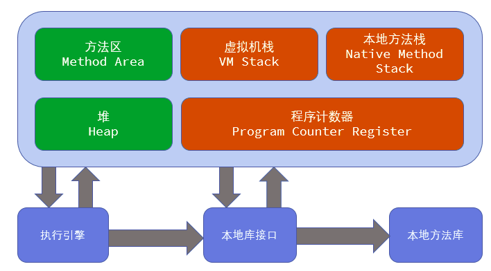
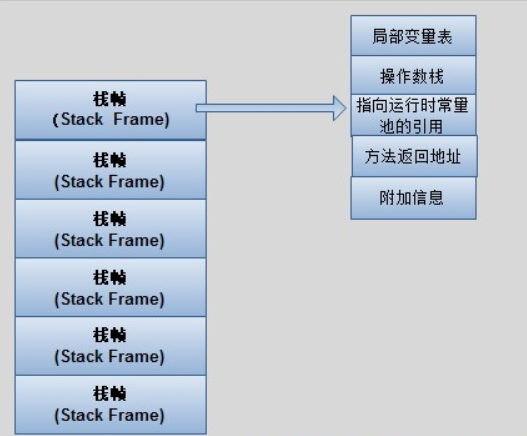

# JVM内存模型

## JVM内存模型

JVM内存模型可以分为两个部分：
  * 线程共有：堆（Heap）和方法区（Method Area）
  * 线程私有：虚拟机栈（VM Stack），本地方法栈（Native Method Stack）,程序计数器（Program Counter Register）

### 程序计数器（PC寄存器）
程序计数器是一块较小的内存空间，它的作用可以看作是当前线程所执行的字节码的行号指示器。在虚拟机的概念模型里（仅是概念模型，各种虚拟机可能会通过一些更高校的方式去实现），字节码解释器（执行引擎）工作时就是通过改变这个计数器的值来选取下一条需要执行的字节码指令，分支、循环、跳转、异常处理、线程恢复等基础功能都需要依赖这个计数器来完成。

由于Java虚拟机的多线程是通过线程轮流切换并分配处理器执行时间的方式来实现的。在任何一个确定的时刻，一个处理器（对于多核处理器来说是一个内核）只会执行一条线程中的指令。因此，为了线程切换后能够恢复到正确的执行位置，每条线程都需要有一个独立的程序计数器，各条线程之间的计数器互不影响，独立存储。我们称这类内存区域为“线程私有”的内存。

如果线程正在执行的是一个Java方法，这个计数器记录的是正在执行的虚拟机字节码指令的地址；如果正在执行的是Native方法，这个计数器值则为空（Undefined）。此内存内区域是唯一一个在Java虚拟机规范中没有没有规定OutOfMemoryError情况的区域。

### 虚拟机栈（VM Stack）
Java虚拟机栈也是线程私有的，它的生命周期与线程相同。虚拟机栈描述的是Java方法执行的内存模型：每个方法被执行的时候都会同时创建一个栈帧（Stack Frame）用于存储局部变量表、操作栈、动态链接、方法出口等信息。每一个方法被调用直至执行完成的过程，就对应着一个栈帧在虚拟机栈中入栈到出栈的过程。

下图是栈帧的示意图：

  * 局部变量表（Local Variables），存放了编译器可知的各种基本数据类型（boolean,byte,char,short,int,float,long,double）、对象引用（reference类型，它不等同于对象本身，根据不同的虚拟机实现，它可能是一个指向对象起始地址的引用指针，也可能指向一个代表对象的句柄或者其他于此对象相关的位置）和returnAddress类型（指向了一条字节码指令的地址）。其中64位长度的long和double类型的数据会占用2个局部变量空间（Slot），其余的数据类型只占用1个。局部变量表所需的内存空间在编译期间完成分配，当进入一个方法时，这个方法需要在帧中分配多大的局部变量空间是完全确定的，在方法运行期间不会改变局部变量表的大小。
  * 操作数栈（Operand Stack）指向当前方法所属的类的运行时常量池的引用。  
  * 方法返回地址
  * 附加信息

在Java虚拟机规范中，对这个区域规定了
https://www.cnblogs.com/dingyingsi/p/3760447.html

### 方法区（Method Area,HotSport虚拟机把方法区称为永久代Permanent Generation）
