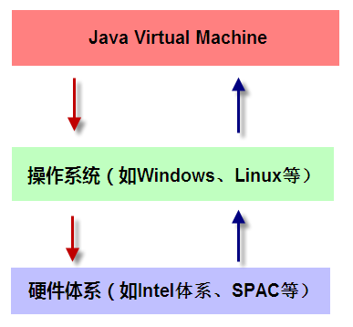
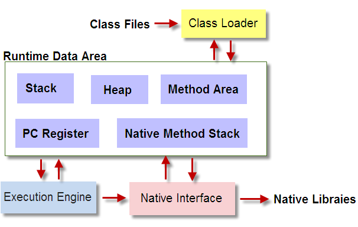

# JVM加载class文件的原理机制

## JVM是什么
JVM全称Java Virtual Machine,也就是在计算机上再虚拟一个计算机。

我们知道计算机的基本构成是：运算器、控制器、存储器、输入和输出设备。JVM也是有这成套的元素，运算器最终当然还是交给CPU处理了，只是为了适应“一次编程，随处运行”的情况，需要做一个翻译动作，于是就用了JVM自己的命令集。这与汇编的命令集有点类似，每一种汇编命令针对一个系列的CPU，比如8086系列的汇编也是可以用在8088上的，但是就不能跑在8051上。然而，JVM的命令集则是可以到处运行的额，因为JVM做了翻译，根据不同的CPU，翻译成了不同的机器语言。

JVM是运行在操作系统之上的，它与硬件没有直接的交互。



## JVM的组成部分



通过这个构成图我们发现整个JVM分为四部分：
  1. 类加载器（Class Loader）

  类加载器的作用就是加载类文件到内存。比如我们编写了一个HelloWorld.java程序，然后通过javac编译成class文件，那怎么才能加载到内存中被执行呢？Class Loader承担的就是这个责任。

  不过，不是随便一个.class文件就能被加载，类加载器加载的class文件是有格式要求的。具体格式参见《JVM Specification 》。

  另外，类加载器只管加载，只要符合文件结构就加载，至于能不能运行，则不是它负责，那是由执行引擎负责。

  2. 运行数据区（Runtime data area）

  运行数据区是整个JVM的重点。我们所有写的程序都被加载到这里，之后才开始运行。Java生态系统如此的繁荣，得益于该区域的优良自治。

  3. 执行引擎（Execution Engine）

  执行引擎也叫做解释器（Interpreter），负责解释命令，然后将命令提交操作系统执行。

  4. 本地接口（Native Interface）

  本地接口的作用是融合不同的变成语言为Java所用，它的初衷是融合C/C++程序。Java诞生的时候是C/C++横行的时候，要想立足，必须有一个聪明的、睿智的调用C/C++程序，于是就在内存中专门开辟了一块区域处理标记为native的代码，它的具体做法是Native Method Stack中等级native方法，在Execution Engine执行时加载native libraier。目前该方法使用的越来越少了，除非是与硬件有关的应用，比如通过Java程序驱动打印机，或者Java系统管理生产设备，在企业级应用中已经比较少见了。因为现在的异构领域间的通信很发达，比如可以使用Socket 通信，也可以使用Web Service 等等，不多做介绍。

## JVM加载class文件的原理机制
Java中的所有类，都需要由类加载器装载到JVM中才能运行。类加载器本身也是一个类，它的工作就是把class文件从硬盘读取到内存中。在写程序的时候，我们几乎不需要关心类加载器，因为这些都是隐式装载的；只有我们用特殊的用法，比如反射，才会显示的加载所需要的类。

Java类的加载是动态的，它并不会一次性将所有类全部加载后再运行，而是保证程序运行的基础类（像是基类）完全加载到jvm中；至于其他类，则在需要的时候才加载。这当然就是为了节省内存开销。

### 类加载器
  Java的类加载器有三个，对应Java的三种类（Java中的类大致分为三种：系统类，拓展类，由程序员自定义的类）：

    * Bootstrap Loader 负责加载系统类（指的是内置类，像是String，对应于C#中的system类和C/C++标准库中的类）
    * ExtClassLoader 负责加载拓展类（就是继承类和实现类）
    * AppClassLoader 负责加载应用类（程序员自定义的类）

  三个加载器各自完成自己的工作，但他们是如何协调工作呢？哪一个类由哪个类加载器完成呢？为了解决这个问题，Java采用了委托模型机制。

  委托模型机制的工作原理很简单：当类加载器需要加载类的时候，先请示其Parent（即上一层加载器）在其搜索路径载入，如果找不到，才在自己的搜索路径搜索该类。这样的顺序其实就是加载器层次自顶而下的搜索，因为加载器必须保证基础类的加载。

### 隐式装载与显式装载

  * 隐式装载，程序在运行过程中当碰到通过new等方式生成对象时，隐式调用类装载对应的类到JVM中。
  * 显式加载，通过class.forname()等方法，显式加载需要的类。

### 类加载过程
下面以一个隐式装在类的过程来说明类加载的详细过程类代码如下：
```
public class ClassCreation {

    public final int num=1;
    public char aChar;
    public String name=“aaa”;
    public Car car;

    public ClassCreation(){};

    public void  aCharUpdate(char c){
        this.aChar=c;
    }
}
```

1. 类引用引发装载。Java的类加载时动态机制，所有类的装载都是在第一次使用类时完成（即当程序中第一次引用类中的静态成员时动态完成的。由于构造方法也是一个静态方法，虽然构造方法中没有static关键字，但它的确是静态方法；那么通过new关键字来创建一个新对象也可以被认为是引用类中的静态成员。
2. 装载。当需要加载一个类时，类加载器会首先检查所需要的类是否已经加载进内存。如果没有，类加载器会根据类路径去查找与类名相同的类文件来加载。
3. 连接。
  * 1)检查：类文件找到后，类加载器会首先检查class文件数据的正确性。
  * 2)准备：检查无误后，JVM为类的静态变量分配存储空间。
  * 3)解析：将符号引用转换为直接引用（这一步是可选的）
4. 类文件（静态）加载。类文件会被加载到内存中的静态区（也叫方法区），静态区中的内容从程序开始到结束的整个区间会一直存在。
5. 分配变量空间。类文件加载入内存以后，JVM会在内存模型的静态区中为类静态成员分配空间并创建变量，在栈区中为基础类型成员变量分配空间并创建变量。在堆区中为引用类型变量分配空间，并依据对应类文件创建变量（猜测，引用变量，变量名存放在栈区中，变量中存在指向对象的内存地址）。
6. 变量初始化。变量创建后，JVM会对类中的成员变量初始化，先初始化静态变量，然后是非静态变量。
  * 1)静态变量初始化：执行静态变量赋值语句,比如上面类中的public final int num=1语句，为静态成员变量赋值。静态变量需要在创建时确定初始值。
  * 2)非静态变量初始化：执行非静态变量赋值语句，比如public char aChar;public String name=“aaa”;public Car car;,为非静态成员变量赋值。若代码中没有指定变量的初始值，则JVM为变量初始化默认值。
7. 执行包括构造方法，main方法在内的静态方法。变量初始化以后，JVM会首先执行类的构造方法，如果构造方法中有成员变量的赋值语句，则对已经初始化的变量重新赋值。至此类已经成功在内存中创建。如果类中有main方法，JVM会在类创建以后，自动执行类的main方法。
