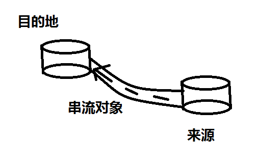
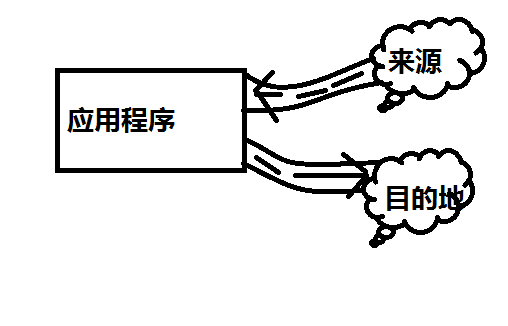
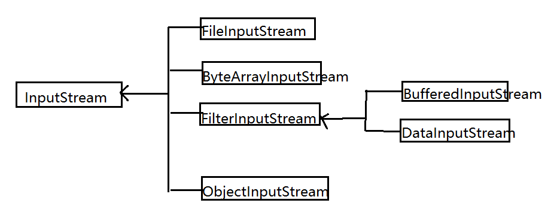
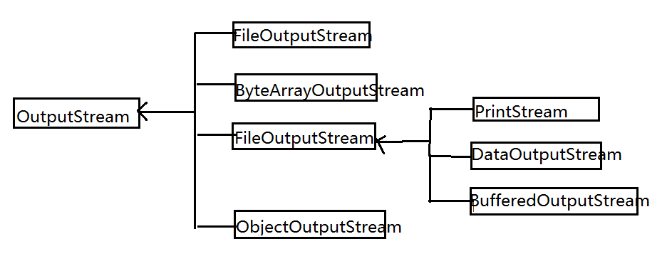

# JavaIO流

## 串流设计的概念
Java将输入/输出抽象化为串流，数据有来源及目的地，衔接两者的是串流对象。比喻来说，数据就好比水，串流好比水管，通过水管的衔接，水由一端流向另一端，如图所示：

从应用程序的角度看，如果要将数据从来源取出，可以使用输入串流，如果要将数据写入目的地，可以使用输出串流。在Java中,输入串流代表对象为java.io.InputStream实例，输出串流代表对象为java.io.OutputStream实例。无论数据源或目的地为何，只要设法取得InputStream或OutputStream的实例，接下来操作输入/输出的方式都是一致的，无须理会来源或目的地的真正形式。如下图：

## （字节）串流继承架构
1. InputStream的常用类继承架构

2. OutputStream的常用类继承架构

## （字节）标准输入/输出（InputStream/OutputStream）

## （字节）串流处理装饰器
InputStream、OutputStream提供串流基本操作，如果想要为输入/输出的数据做加工处理，则可以使用打包器类。比如：Scanner类就是打包器，它接受InputStream实例，你操作Scanner打包器相关方法，Scanner会实际操作打包的InputStream取得数据，并转换为你想要的数据类型。

常用的打包器有具备缓冲区作用的BufferedInputStream、BufferedOutputStream,具备数据转换处理作用的DataInputStream、DataOutputStream,具备对象串化能力的ObjectInputStream、ObjectOutputStream等。

由于这些类本身并没有改变InputStream、OutputStream的行为，只不过在InputStream取得数据之后，再做一些加工处理，或者是要输出时做一些加工处理，再交由OutputStream真正进行输出，因此又称他们为装饰器（Decorator）。比如：Buffered流就像小水管衔接大水管，如小水管读入数据，再由大水管增加缓冲功能。

## 字符处理类
InputStream、OutputStream是用来读入与写出字节数据，若实际上处理的是字符数据，使用InputStream、OutputStream就得对照编码表，在字符与字节之间进行转换。索性JavaSE API已提供相关输出\输出字符处理类（Reader、Writer），让你不用亲自进行字节与字符编码转换的枯燥工作。

## 字符流（Reader、Writer）继承架构

## 字符处理装饰器
1. InputStreamReader与OutputStreamWriter
2. BufferedReader与BufferedWriter
3. PrintWriter
