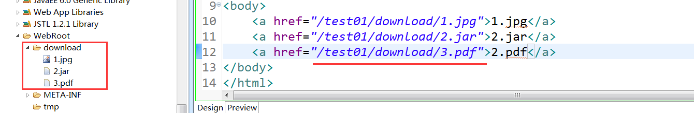
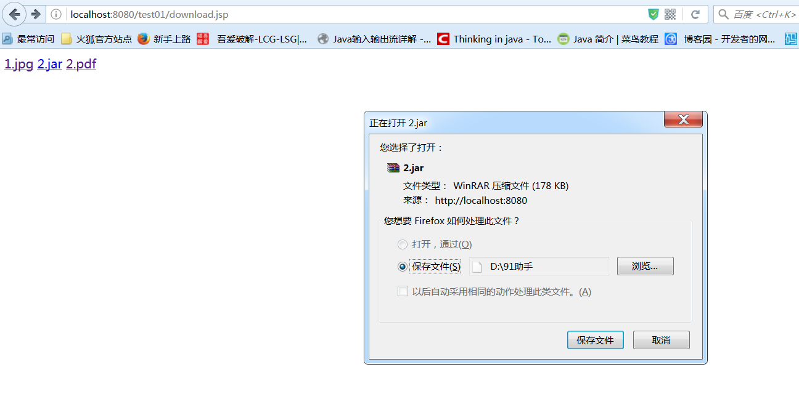

# fileupload和filedownload组件的使用

## commons-fileupload组件介绍
commons-fileupload组件是由Apache开发的一个应用于文件上传的组件，其特点就是使用方便、简单。commons-fileupload.jar通常和commons-io.jar包一起使用的。用来操作文件上传。里面封装了很多上传的功能，大大简化了我们写上传代码的复杂性。

## 理解文件上传

1. 为什么要用文件上传工具？
实际上在Servlet中，我们使用Request的方式就可以向服务器端上传文本数据，但是其过程比较费劲；而且如果上传的是图片等资源，则无法上传。还有一个很重要的原因是一般上传的文件数据都很大。

2. 文件上传的本质？
文件上传的本质就是IO流的操作。服务器端通过流读取数据，然后对数据进行解析，得到上传文件的内容，然后保存在服务器端。

3. 客户端如何上传数据？
  * method="post",因为提交的数据会比较大，所以要使用Post提交。
  * 必须有name属性。
  * 在input标签中设置属性encType="Multipart/form-data"

4. 服务器端如何处理数据？
  * 用request对象获取请求信息
  * 通过request的getInputStream()方法，可以读取到所有请求的正文消息。
  * 操作IO流，将所需要的信息保存在服务器。

## fileupload包中的核心类
结合下面代码理解核心类：
```
//创建FileItemFactory
FileItemFactory factory=new DiskFileItemFactory();
//创建ServletFileUpload实例
ServletFileUpload upload=new ServletFileUpload(factory);
//利用upload，从request请求中获取上传表格内容
List<FileItem> files=upload.parseRequest(req);
```
1. FileItem接口：
FileItem接口中定义了用于处理表单内容以及文件内容的方法。在应用过程中，每一个表单中的单个字节元素，都会被封装成一个FileItem类型的对象，通过调用FileItem对象的相关方法可以得到相应表单字段元素的数据。在应用中，可以直接用FileItem接口进行访问。
2. FileItemFactory接口和DiskFileItemFactory类：
用于创建ServletFileUpload类
3. ServletFileUpload类：
Apache文件上传组件中用于处理文件上传的一个核心类。它的作用是以List形式返回每一个被封装成FileItem类型的表单元素集合。

## 图片上传代码示例：
```
protected void doPost(HttpServletRequest req, HttpServletResponse resp) throws ServletException, IOException {
        //图片上传的实现
        req.setCharacterEncoding("utf-8");
        List<String> filelist=new ArrayList<String>();
        filelist.add(".jpg");
        filelist.add(".png");
        filelist.add(".gif");
        boolean isMulitpart= ServletFileUpload.isMultipartContent(req);
        if(isMulitpart){
            //创建FileItemFactory
            FileItemFactory factory=new DiskFileItemFactory();
            //创建ServletFileUpload实例
            ServletFileUpload upload=new ServletFileUpload(factory);
            try {
                List<FileItem> files=upload.parseRequest(req);
                for(FileItem file:files){
                    if(file.isFormField()){ //如果是普通表单按普通表单处理
                        String name=file.getString();
                        req.setAttribute("name",name);
                    }else{  //如果是文件
                        String filename=file.getName();//获取文件名
                        String fileext=filename.substring(filename.lastIndexOf("."));  //获取文件后缀名
                        if(filelist.contains(fileext)){   //判断上传文件是否为图片
                            if(file.getSize()<1024*1024){   //判断文件是否小于1M
                                String uploadpath="D:\\netdisk";
                                SimpleDateFormat formator=new SimpleDateFormat("yyyyMMddhhmmss");  //根据当前时间对文件重命名
                                String newfilename=formator.format(new Date())+fileext;
                                File savefile=new File(uploadpath,newfilename);
                                file.write(savefile);
                                req.setAttribute("msg","上传成功");
                                req.setAttribute("imgsrc", "D：/"+newfilename);
                            }else{
                                req.setAttribute("msg","文件只能上传1M以下的 !");
                            }
                        }else {
                            req.setAttribute("msg","只能上传jpb,png,gif的图片");
                        }
                    }
                }
            } catch (FileUploadException e) {
                e.printStackTrace();
            } catch (Exception e) {
                e.printStackTrace();
            }
        }
    }
```
## 实现下载的两种方式

### 方式一、使用a标签，也就是使用超链接，如果浏览器能够解析，则直接显示出来，如果不能解析，则进行下载。

  

  

这种方式不太好，我使用的是火狐，第一个和第三个能直接解析出来，而第二个则不能解析，显示的是下载页面。

### 方式二、让浏览器知道应该下载，而不是解析。实现步骤：
1. 设置响应头，让浏览器知道应该下载，而不是解析
2. 获取输入流，指向需要下载的文件
3. 获取输出流，将其文件传到浏览器端：
4. 使用IOUtils.copy(is，out);直接将输入流和输出流传进去，就会帮我们把输出流读到的内容通过输出流输出到浏览器。

### 实例代码
```
//设置content-disposition响应头
response.setHeader("content-disposition", "attachment;filename=" +fileName);　
InputStream is = this.getServletContext().getResourceAsStream("/download/1.jpg");
ServletOutputStream out = response.getOutputStream();
```
### 文件下载总结

下载其实非常简单，就是在编写下载文件名出现的中文乱码问题比较麻烦，其他的套路很容易：
  * 设置响应头，让浏览器知道文件是需要下载的；
  * 找准要下载的文件的路径从而拿到输入流，再通过response拿到输出流；
  * 通过IOUtils.copy(in，out)就解决了，不用在乎其中内如的实现。

### IOUtils.copy()方法的原理
```
int b = -1;

byte[] bf = new byte[1024];

while((b=is.read(bf)) != -1){

　　out.write(bf,0,b);

　　　　　　　　　　　　　　　}
```
