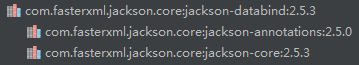

# Java的JSON解析

## Java的四种JSON解析方式
1. JSON官方:官方的解析最具通用性，但是有点小麻烦
2. GSON：谷歌的解析器，比较好用
3. FastJSON：阿里巴巴的产品，效率最高
4. Jackson：SpringMVC内置的解析器就是这个

这些小工具，没必要都去掌握，但至少要能熟练使用一个。相比较而言，Jackson相对来说比较高效，在项目中主要使用Jackson进行JSON和Java对象转换，下面详细讲解Jackson的使用。

## 下面详细讲解Jackson的使用
1. 准备Jar包
    * jackson-core-2.2.3.jar（核心jar包）
    * jackson-annotations-2.2.3.jar（该包提供Json注解支持）
    * jackson-databind-2.2.3.jar

如果是通过maven依赖管理jar包，那么下面一个依赖就够了。
```
<dependency>
    <groupId>com.fasterxml.jackson.core</groupId>
    <artifactId>jackson-databind</artifactId>
    <version>2.5.3</version>
</dependency>
```

 

 2. 创建用于测试的Java类
 ```
 public class User {

         private Integer userId;
         private String userName;
         private String userPassword;
         private Date userBirthday;

         public Integer getUserId() {
             return userId;
         }
         public void setUserId(Integer userId) {
             this.userId = userId;
         }
         public String getUserName() {
             return userName;
         }
         public void setUserName(String userName) {
             this.userName = userName;
         }
         public String getUserPassword() {
             return userPassword;
         }
         public void setUserPassword(String userPassword) {
             this.userPassword = userPassword;
         }
         public Date getUserBirthday() {
            return userBirthday;
        }
        public void setUserBirthday(Date userBirthday) {
            this.userBirthday = userBirthday;
        }
 }
 ```

3. 使用Jackson序列化User类
```
public void test() throws Exception {
        User user1=new User();
        User user2=new User();
        user1.setUserId(1);
        user1.setUserName("leon");
        user1.setUserPassword("123");
        user2.setUserId(2);
        user2.setUserName("Wang");
        user2.setUserPassword("123");

        SimpleDateFormat dateFormat=new SimpleDateFormat("yyyy-MM-dd");
        user1.setUserBirthday(dateFormat.parse("1985-10-25"));

        ObjectMapper mapper=new ObjectMapper();
        //User类转JSON
        String jsonString=mapper.writeValueAsString(user1);
        System.out.println(jsonString);
        //Java集合转JSON
        List<User> users= new ArrayList<User>();
        users.add(user1);users.add(user2);
        String jsonlist= mapper.writeValueAsString(users);
        System.out.println(jsonlist);
//{"userId":1,"userName":"leon","userPassword":"123","userBirthday":499017600000}
//[{"userId":1,"userName":"leon","userPassword":"123","userBirthday":499017600000},{"userId":2,"userName":"Wang","userPassword":"123","userBirthday":null}]
    }
```
4. 使用Jackson反序列化Json字符串
```
//转字符串到对象
User userFromJSON=mapper.readValue(jsonString,User.class);
//转字符串到对象列表
List<User> userList=mapper.readValue(jsonlist, new TypeReference<List<User>>(){});
```
5. JSON注解
Jackson提供了一系列注解，方便JSON序列化和反序列化进行控制，下面介绍几个常用的注解。
 * @JsonIgnore:此注解用于属性上，作用是进行JSON操作时忽略该属性。
 * @JsonFormat：此注解用于属性上，作用是Date类型直接转化为想要的格式，如@JsonFormat(pattern = "yyyy-MM-dd HH-mm-ss")。
 * @JsonProperty：此注解用于属性上，作用是把该属性的名称序列化为另外一个名称，如把trueName属性序列化为name，@JsonProperty("name")。
 ```
 import com.fasterxml.jackson.annotation.JsonFormat;
 import com.fasterxml.jackson.annotation.JsonIgnore;
 import com.fasterxml.jackson.annotation.JsonProperty;

 import java.util.Date;

 /**
  * JSON序列化和反序列化使用的User类
  */
 public class User {

     private String name;

     //不JSON序列化年龄属性
     @JsonIgnore
     private Integer age;

     //格式化日期属性
     @JsonFormat(pattern = "yyyy年MM月dd日")
     private Date birthday;

     //序列化email属性为mail
     @JsonProperty("my_email")
     private String email;

     public String getName() {
         return name;
     }

     public void setName(String name) {
         this.name = name;
     }

     public Integer getAge() {
         return age;
     }

     public void setAge(Integer age) {
         this.age = age;
     }

     public Date getBirthday() {
         return birthday;
     }

     public void setBirthday(Date birthday) {
         this.birthday = birthday;
     }

     public String getEmail() {
         return email;
     }

     public void setEmail(String email) {
         this.email = email;
     }

     @Override
     public String toString() {
         return "User{" +
                 "name='" + name + '\'' +
                 ", age=" + age +
                 ", birthday=" + birthday +
                 ", email='" + email + '\'' +
                 '}';
     }
 }
 import com.fasterxml.jackson.databind.ObjectMapper;
 import java.io.IOException;
 import java.text.ParseException;
 import java.text.SimpleDateFormat;

 public class JacksonDemo {

     public static void main(String[] args) throws ParseException, IOException {
         User user = new User();
         user.setName("zhangsan");
         user.setEmail("zhangsan@163.com");
         user.setAge(20);

         SimpleDateFormat dateformat = new SimpleDateFormat("yyyy-MM-dd");
         user.setBirthday(dateformat.parse("1996-10-01"));

         ObjectMapper mapper = new ObjectMapper();
         String json = mapper.writeValueAsString(user);
         System.out.println(json);
     }
 }
 //{"name":"zhangsan","birthday":"1996年09月30日","my_email":"zhangsan@163.com"}
 ```
