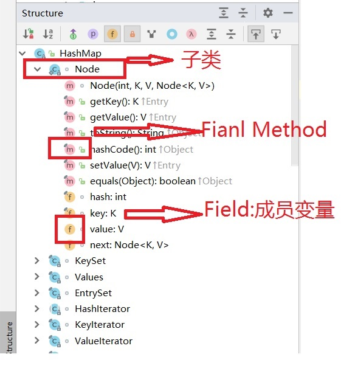
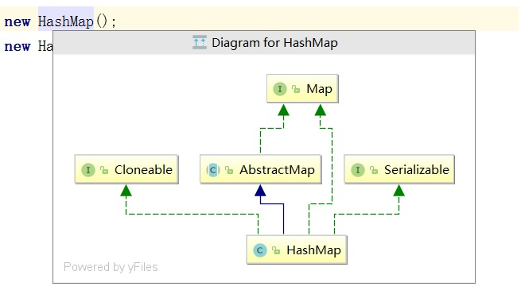
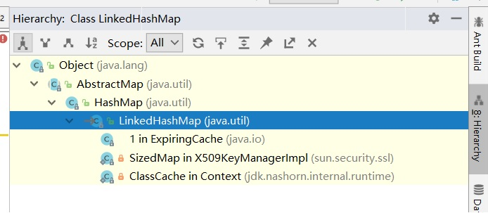
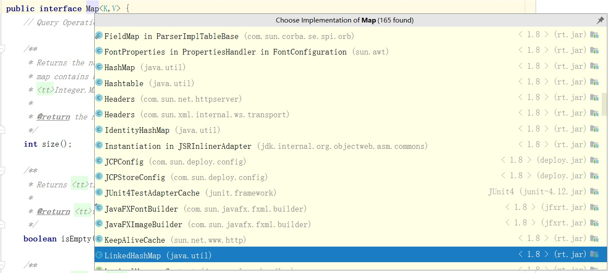

# IDEA阅读源码技巧

“工欲善其事必先利其器”，这句话同样适用于程序开发领域，而且还格外适用于今天的程序开发。过去的开发工具相对匮乏，今天我们身边充斥了各种各样便捷的工具。善于利用这些工具，才能能事半功倍。

IDEA就是这样一个能在阅读源码这件事上提供很多帮助的工具。下面总结结几个IDEA阅读源码的技巧。

## 一、Alt+7或点击左侧边栏Structure查看类的完整结构
下图是Java HashMap源码的结构列表，有了它我们可以快速得对HashMap的内部结构有个整体的认识，并且还可以快速找到类中的任何组件，比如成员变量、构造方法、方法等。

## 二、查看类继承关系图：Ctrl+Alt+U
抽象类，接口，集成这些类与类之间的关系，常常让看源代码的我们无从下手，可以借助类继承关系图的帮助：

## 三、查看当前类的继承树：Ctrl+H

## 四、查看接口类的实现方法：Ctrl+Alt+B

## 五、查看Java方法调用树(被调/主调)：Ctrl+Alt+H

## 六、查看定义的变量在哪里被调用：Ctrl+Alt+F7
