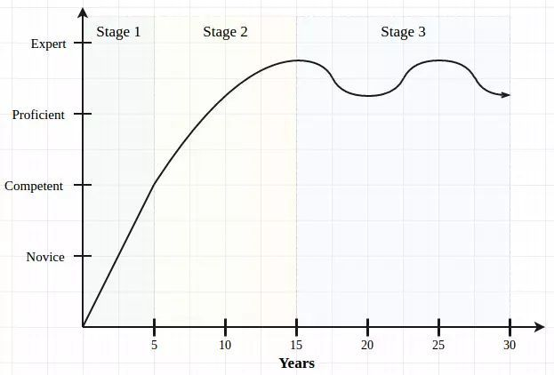

# 一名老技术人关于学习与成长的分享

## 导读
Ben Northrop 满 40 岁，本文是他对职业生涯的思考。他认为从长远来看，应该多投资一些不容易过期、衰竭期较长的知识领域中。

## 编程生涯的独特
我是一名程序员，几个月前刚过完 40 岁生日。某个星期六的早晨，我参加了一个 React Native 技术交流会，演讲者正在竭力说服我们为什么它会成为移动开发领域真正的下一个大事件。但对我来说，它有点像 15 年前的 JSP，将所有的逻辑都放在演示代码里面。但我“老”了，我认为这是因为自己还没有完全理解它。

演讲者展示完 PPT 后，现场进行编码，还展示了大约半打我没听说过的配套工具，这些都让我感到有点沮丧。

当然，我并不是真的惊讶。在过去 20 年里，我也掌握了一些比较流行的技术，并享受驾驭它们的乐趣。新的东西总能给编程带来一丝激动的体验，并且能让事情变得更容易、更快和更清楚。但是在这个特别的早晨，在40岁的这个门槛上，我不得不承认我感觉有些落伍。我知道如果想跟上节奏，我得继续付出，抛弃一些已经充分吸收的知识，吸收一些新的知识，为下一次旅程做准备。

我在想，我的编程生涯不像其他的专业人士，医生到了 40 岁不用担心他对血管系统的知识会蒸发，同样的，律师、水管工、会计、英语老师，也是如此。他们积累的知识是相对稳定的，并随着年龄会给予他们相应的尊重和补偿。但是在编程领域，20年的经验，似乎并没有赋予同样的优势。

## 两个概念
当然，我们的行业也不是那么糟糕 —— 程序员需要爱上很多东西 —— 有趣的是，无休止的跟进，好像是我们这个领域或多或少独一无二的特点。编程生涯是真的如此不同吗？如果是，为什么？对我们的事业轨迹来说又意味着什么？我想从以下两个观点来尝试回答这些问题。

### 第一个是知识衰退。
我们所知道的一切，不仅仅是编程，都有一个有效期，过了这个期限将不再有用。我16岁学会了开车，到现在依然用的很好，这种技能可以认为有一个相对较长的半衰期 。医生的知识会越来越渊博，是因为他学习的每一件事情都是基于他以前的知识。而在编程领域，无论好还是坏，我认为：
```
程序员所积累的编程知识在十年后将有一半没用。
```
这可能有些偏激……但起码对我来说，似乎是正确的。如果我在这个期限中不学任何其他的东西，我敢打赌，只有大约一半的知识我可以在 2026 年继续使用（比如长期活着的 SQL ），另一半可能都是没用的（React Native，也许？） 。当然，我会不断获得新的知识来取代要死掉的那些东西，但这足够吗？ 2026 年我会比现在知道更多（有用的）知识吗？

### 这也就是带来了第二个概念，知识积累速度。
在所有领域，必须满足一定的知识门槛才能获得“认证”（或至少可聘用），职业生涯的早期通常都是在努力获取知识。然而，在编程领域，由于知识的快速衰减，似乎我们从来没有真正度过“学生时期”，我们必须永远一直学习。

## 三个阶段
如果去记录程序员的知识衰退和积累速度，我认为可能会是这样：



### 在职业生涯的开始，可以称之为热切的学徒阶段，积累知识比较容易。
一切都是新的，每个经验都是获得更多知识的工具。而且，由于年轻，我们不会有太多的义务，所以可能不介意花几个晚上和周末拿起新的语言和框架。重要的是，雇主对我们的期望值也比较低，我们可以在工作期间抠出一点时间来填补知识。这是一个有趣的阶段，连自己都没意识到自己有多坚持。

### 然后，我们不再是新手，成为了自给自足的开发者。
我们在学习中的投资已经得到回报，所知道的一切全部有用。在这个充满知识的阶段，我们开始赢得客户、同行和管理者的尊重，获得头衔、薪水和机会。虽然我们当时不一定看得出来，但这也是一个重要的转折点。

两件事情发生了。首先，“高级”的晋升不仅仅是金钱，而是更多的期待。雇主需要他们的“明星程序员”成为领导者 – 帮助初级开发人员，审查代码，执行访谈，参加更多会议，帮助他们维护、构建复杂的旧版软件。这一切都很合理，但它巧妙地牺牲了我们的知识积累速度，我们不再有时间去读一些科技博客、文章。第二，这时候，我们首次体会到（或至少认识到）一点点知识的朽烂，早期学到的一些东西开始过时了。
### 随后，我们进入第三个，也是最后一个阶段，衰落和流失。
是的，我们是知识渊博和富有成就的，但我们也明白，事实上知道的已经比最初阶段更少（有用的）东西。我们可能没有时间积累足够的新知识来填补，这是令人沮丧的。我认为这就是为什么，在这时候，许多人开始转向 – 管理、销售、测试或农业（我的梦想）。我们意识到需要再次努力来保持我们的水平和熟练度 – 不然的话，我们的工作会在5年后比现在更糟。

## 两个方向
我正处于第三阶段。我还是很喜欢学习，但我明白，不努力的话，我可能会一直保持在“专家”的平衡状态边缘。
### 首先，我尝试采取长远的观点。
不要过度榨取自己，要尽可能的取得获得新经验的机会。我看到不少同事虽然获得了丰厚的薪酬，但职业很少有机会接触新兴事物。再过五年，他们会意识到他们的宝贵知识已经蒸发，薪酬与实际价值相去甚远。在某些情况下，我认为短期内赚更少的钱（有更好的雇主）会在长期的职业生涯中产生更多的钱（和稳定）。
### 第二，考虑到时间有限，我试图去学习那些耐用的知识。
也就是说，把精力投入在那些有更长的衰减期的知识上，比如，算法逻辑、应用安全、性能优化和架构。
