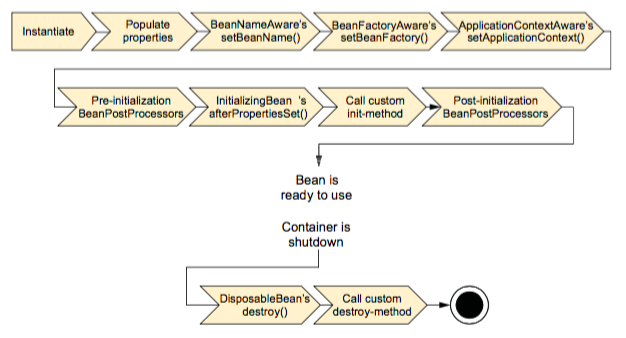

# Spring容器

容器是Spring框架的核心。Spring容器使用DI管理构成应用的组件，它会创建相互协作的组件之间的关系。在基于Spring的应用中，你的应用对象生存于Spring容器中。Spring容器负责创建对象，装配它们，配置它们并管理他们的整个生命周期，从生存到死亡。


在下一章，我们将了解如何配置Spring，从而让它知道该创建、配置和组装哪些对象。但首先，最重要的是了解容纳对象的容器。理解容器将有助于理解对象是如何被管理的。

## 两种类型的Spring容器
Spring容器并不是只有一个。Spring自带了多个容器实现，可以归为两种不同的类型：
  1. bean工厂：org.springframework.beans.factory.BeanFactory。最简单的容器，提供基本的DI支持。
  2. 应用上下文：org.springframework.context.ApplicationContext。基于BeanFactory构建，并提供应用框架级别的服务。

## 应用上下文
Spring自带了多种类型的应用上下文。下面罗列的几个是你最有可能遇到的。
  * AnnotationConfigApplicationContext:从一个或多个基于Java的配置类中加载Spring应用上下文。
  * AnnotationConfigWebApplicationContext：从一个或多个基于Java的配置类中加载SpringWeb应用上下文。
  * ClassPathXmlApplicationContext:从类路径下的一个或多个XML配置文件中加载上下文定义，把应用上下文的定义文件作为类资源。
  * FileSystemXmlapplicationcontext:从文件系统下的一个或多个XML配置文件中加载上下文定义。
  * XmlWebApplicationContext:从Web应用下的一个或多个XML配置文件中加载上下文定义。

无论是从文件系统中装载应用上下文还是从类路径下装在应用上下文，将bean加载到bean工厂的过程都是相似的。
```
ApplicationContext context=new FileSystemXmlapplicationcontext("c:/knight.xml")
ApplicationContext context=new ClassPathXmlApplicationContext("knight.xml")
ApplicationContext context=new AnnotationConfigApplicationContext("com.springinaction.knights.config.KnightConfig.class")
```

## bean的生命周期
正确理解Spring bean的生命周期非常重要，因为你或许要利用Spring提供的扩展点来自组定义bean的创建过程。下图展示了bean装载到Spring应用上下文的一个典型的生命周期过程。



在bean准备就绪之前，bean工厂执行了若干启动步骤：
  1. Spring对bean进行实例化；
  2. Spring将值和bean的引用注入到bean对应的属性中；
  3. 如果bean实现了BeanNameAware接口，Spring将bean的ID传递给setBeanName()方法；
  4. 如果bean实现了BeanFactoryAware接口，Spring将调用setBeanFactory()方法,将BeanFactory容器实例传入；
  5. 如果bean实现了ApplicationContextAware接口，Spring将调用setApplicationContext()方法，将bean所在的应用上下文的引用传入进来；
  6. 如果bean实现了BeanPostProcessor接口，Spring将调用postProcessBeforeInitialization()方法；
  7. 如果bean实现了InitializingBean接口，Spring将调用afterPropertiesSet()方法。类似地，如果bean使用init-method声明了初始化方法，该方法也会被调用；
  8. 如果bean实现了BeanPostProcessor接口，Spring将调用它们的postProcessAfterInitialization()方法；
  9. 此时，bean已经准备就绪，可以被应用程序使用了，他们将一直驻留在应用上下文中，直到该应用上下文被销毁；
  10. 如果bean实现了DisposableBean接口，Spring将调用它的destroy()接口方法。同样，如果bean使用destroy-method声明了销毁方法，该方法也会被调用。
