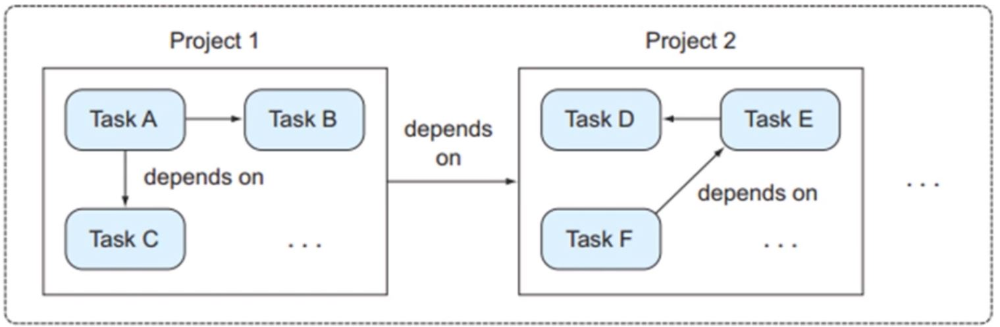

# Gradle项目和任务

Gradle构建（build.gradle）中的两个基本概念是项目（project）和任务（task），每个构建至少包含一个项目，项目中包含一个或多个任务。在多项目构建中，一个项目可以依赖于其他项目；类似的，任务可以形成一个依赖关系图来确保他们的执行顺序。

在Gradle中，每一个待构建的工程是一个project,构建一个Project需要执行一系列Task,比如编译、打包这些构建过程的子过程都对应着一个Task。

## 项目-任务关系



## 项目
一个项目代表一个正在构建的组件（比如一个jar文件）当构建启动后，Gradle会基于build.gradle实例化一个org.gradle.api.Project类，并且能够通过project变量使其隐式可用。

也就是说在build.gradle里面，所有的变量，方法的调用都是在project上面，无路你使用了project还是没使用。

项目（org.gradle.api.Project）的属性和方法

属性：group、name、version

apply、dependencies、repositories,task

例如：
```
plugins {
    id 'java'
}

group 'com.leon'
# project.group='com.leon' 与上句等价，都是调用project的setGroup()方法
version '1.0-SNAPSHOT'

sourceCompatibility = 1.8

repositories {
    mavenCentral()
}

dependencies {
    testCompile group: 'junit', name: 'junit', version: '4.12'
}
```

## 任务
任务对应org.gradle.api.Task。主要包括任务动作和任务依赖。任务动作定义了一个最小的工作单元。可以定义依赖于其他任务、动作序列和执行条件。

我们可以自定义任务，也可以使用插件（apply plugin:'war'）自带的任务

任务中的重要方法：

dependsOn

doFirst,doLast
